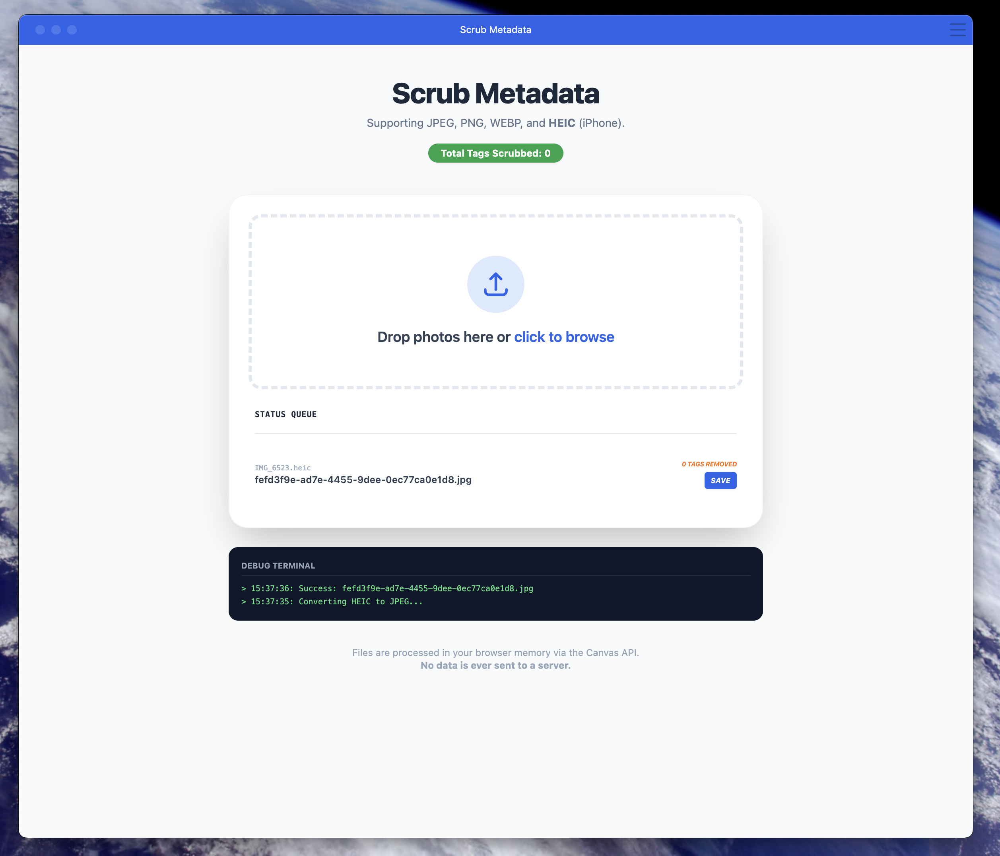

### Scrub Metadata

Clean your images locally using your local browser, no data sent to a server. This is a progressive web app so you can add to your local machine so that it behaves like a standalone app.

#### Screenshot

Here is a screenshot of the web app add to my dock on MacOS

    

